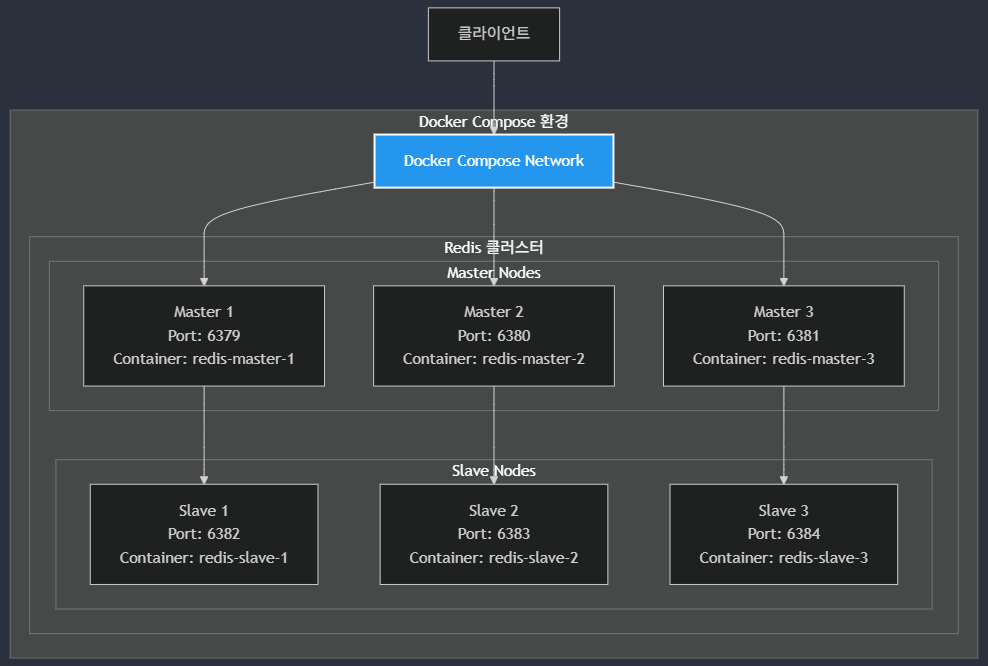
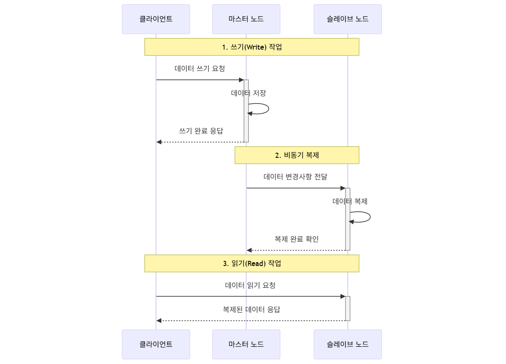
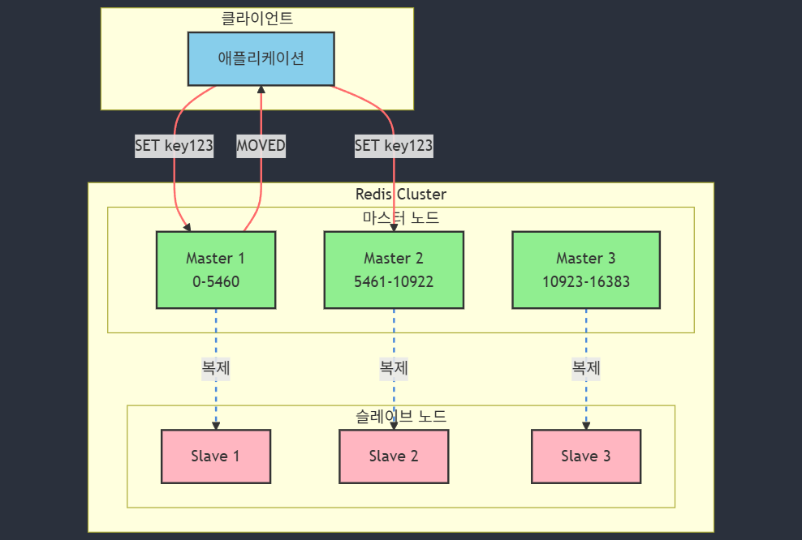
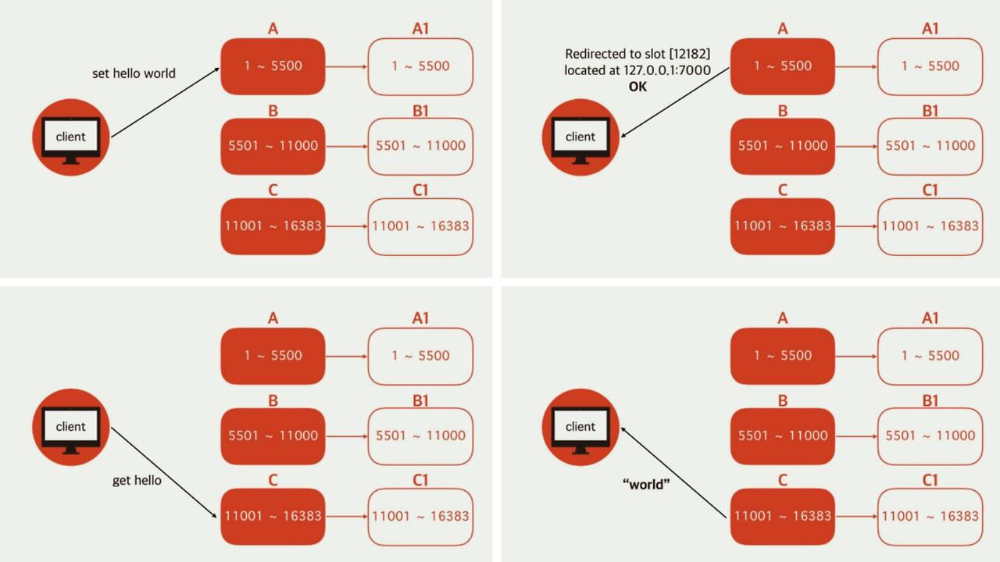
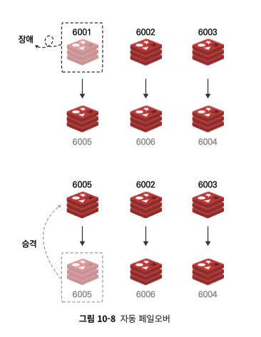
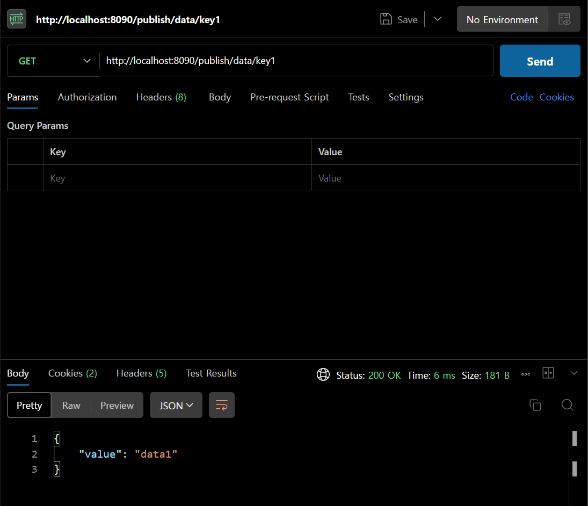
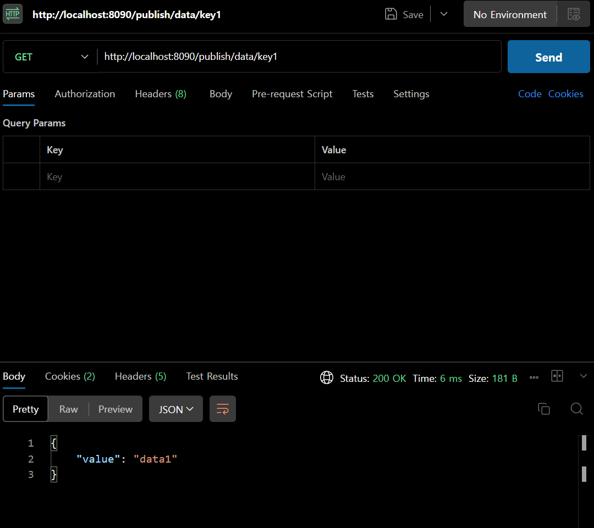

<div align="center">

# 🏛️ Redis Cluster
### Redis Cluster를 통해 Replication 구현

<br/>

[]()
[]()
[]()
[]()
</div>

### 🎯 프로젝트 목적

**고가용성 분산 시스템 구현**
- Redis Cluster를 활용한 데이터 분산 저장 및 자동 장애 복구 시스템 구축
- Master-Slave 구조의 Replication을 통한 데이터 안정성 확보
- Spring Data Redis를 활용한 효율적인 데이터 접근 계층 구현

**기술적 이해도 향상**
- Redis Cluster의 데이터 분산 및 Failover 메커니즘 학습
- 분산 시스템에서의 데이터 일관성과 가용성 보장 방식 이해
- Spring Boot와 Redis 통합 아키텍처 설계 및 구현
## 📝 프로젝트 설명

### 1️⃣ 프로젝트 기술 스택

| 구분 | 기술 | 버전/설명 |
|------|------|-----------|
| **Backend** | Java | 17 |
| | Spring Boot Data Redis | Redis 연동을 위한 Spring Boot 모듈 |
| **Database** | Redis | 인메모리 데이터 저장소 |
| | Redis Insight | Redis 관리 및 모니터링 도구 |
| **인프라** | Docker | 컨테이너 가상화 플랫폼 |
| | Docker Compose | 멀티 컨테이너 애플리케이션 관리 도구 |

### 2️⃣ Redis Cluster 구성도




**노드 구성**
- 3개의 마스터 노드 (Master1, Master2, Master3)
- 각 마스터 노드당 1개의 슬레이브 노드 (Slave1, Slave2, Slave3)
- 총 6개의 노드로 구성된 고가용성 클러스터

**데이터 분산**
- 16,384개의 해시 슬롯을 마스터 노드들에게 균등하게 분배
- 각 마스터 노드는 할당된 해시 슬롯에 대한 데이터 관리 담당

**고가용성**
- 마스터 노드 장애 시 해당 슬레이브가 자동으로 마스터로 승격
- 자동 장애 복구(Auto-Failover) 지원


<details>
<summary><b>📚 부록: 노드란? , 마스터-슬레이브간 데이터 저장 다이어그램</b></summary>

### 노드란?
- 노드는 클러스터의 구성 요소이며, 데이터를 저장하고 관리하는 역할을 한다.

 **마스터 노드**
 - 데이터를 저장하고 관리하는 역할

 **슬레이브 노드**
 - 마스터 노드의 복제본 역할, 마스터 장애 시 자동으로 마스터로 승격
 - 오직 Read Only 역할만 수행 (Write 는 마스터만이 가능)


### 마스터-슬레이브간 데이터 저장 다이어그램



#### 데이터 복제 프로세스 상세 설명

1. **쓰기(Write) 작업**
   - 클라이언트는 반드시 마스터 노드로 쓰기 요청을 보냄
   - 마스터 노드만이 데이터 변경 권한을 가짐
   - 쓰기 작업 완료 후 클라이언트에게 즉시 응답

2. **비동기 복제 과정**
   - 마스터 노드는 데이터 변경사항을 슬레이브에게 전파
   - 비동기 방식으로 진행되어 일시적인 데이터 불일치 가능
   - 복제 과정은 백그라운드에서 자동으로 수행

3. **읽기(Read) 작업**
   - 읽기 작업은 마스터 또는 슬레이브 노드 모두에서 가능
   - 부하 분산을 위해 주로 슬레이브 노드에서 읽기 작업 처리
   - 실시간성이 중요한 경우 마스터 노드에서 읽기 수행

</details>

### 3️⃣ 데이터 리다이렉션



**리다이렉션 프로세스**
- 클라이언트가 Master 1에 데이터 저장 요청
- 해당 키의 슬롯이 다른 마스터에 속한 경우 MOVED 응답
- 클라이언트는 올바른 마스터 노드(Master 2)로 재요청

**즉, Redis Cluster는 각 노드별로 데이터를 서로 공유 하는것이 아니고 리다이렉션한다.**


### 4️⃣ 클러스터 구조



#### 해시 슬롯 구조
- A(Master): 1 ~ 5500 슬롯 담당
- B(Master): 5501 ~ 11000 슬롯 담당
- C(Master): 11001 ~ 16383 슬롯 담당
- 각 마스터 노드는 자신의 슬레이브(A1, B1, C1)와 데이터 동기화

<details>
<summary><b>📚 알아야할것</b></summary>

Q. 예를 들어 해시 슬릇이 16383개로 충분한가?
A. 슬롯은 데이터를 저장할 수 있는 범위를 나누는 개념이며, 실제 데이터 용량과는 무관

Q. 해시는 중복될 수 있는가?
A. 해시 값은 중복될 수 있으며 , 충돌이 발생하더라도, 동일한 슬롯에 키-값 쌍이 개별적으로 저장되므로 데이터는 문제없이 관리

</details>

#### 데이터 처리 흐름
1. **쓰기 요청 (set hello world)**
   - 클라이언트가 키 'hello'에 대한 쓰기 요청
   - 해시 슬롯 계산 후 해당 마스터 노드로 리다이렉션

2. **읽기 요청 (get hello)**
   - 클라이언트가 키 'hello'에 대한 읽기 요청
   - 해당 키가 저장된 노드로 자동 리다이렉션

3. **응답 처리**
   - 올바른 노드에서 "world" 값 반환
   - 클라이언트는 리다이렉션된 결과를 받아 처리


### 5️⃣ Failover


**순서**
1. 마스터 노드 장애 발생 (Redis 노드 Down)
2. 슬레이브 노드 중 하나가 마스터로 승격

**번외**
1. ```set "key" "helloworld" ``` 를 저장하여 마스터1번 노드 , 슬레이브 1번노드 저장
2. 마스터1번 , 슬레이브1번 노드 장애 발생

<details>
<summary><b>예상결과</b></summary>

- ```get "key"``` 를 통해 데이터 조회할 시 에러발생

**이유**
- Redis Cluster는 해싱방식으로 데이터를 분산저장하며 , 데이터 조회 시 해당 키의 슬롯이 다른 마스터에 속한 경우 MOVED 응답
  하기 때문
</details>


## ➡️ 진행 과정

1. Docker Compose를 통해 각 Node 컨테이너 구성

```yaml
#... 생략
x-redis-common: &redis-common
  image: redis:6.2 
  networks:
    - redis-net
  command: >
    redis-server 
    --port 6379
    --bind 0.0.0.0
    --protected-mode no
    --cluster-enabled yes
    --cluster-node-timeout 5000
    --appendonly yes
    --cluster-require-full-coverage no
    --cluster-allow-reads-when-down yes

services:
  redis-node-1: # 마스터 노드 1
    <<: *redis-common
    container_name: redis-node-1
    ports:
      - "6379:6379" # 포트 6379
      - "16379:16379" # 포트 16379
    volumes:
      - redis_node1_data:/data  # 각 노드별 데이터 저장 위치
    networks:
      redis-net:
        ipv4_address: ${HOST_IP:-127.0.0.1} # 각 노드별 IP 주소
    command: >
        #... 실행 커맨드
  redis-node-4: # 슬레이브 노드 1
    <<: *redis-common
    container_name: redis-node-4
    # ...

    # 초기 클러스터 구성
  redis-cluster-init:
    image: redis:6.2
    depends_on:
      - redis-node-1
      - redis-node-2
      - redis-node-3
      - redis-node-4
      - redis-node-5
      - redis-node-6
    command: >
      bash -c "echo 'yes' | redis-cli --cluster create 
      ${HOST_IP:-127.0.0.1}:6379 
      ${HOST_IP:-127.0.0.1}:6380 
      ${HOST_IP:-127.0.0.1}:6381 
      ${HOST_IP:-127.0.0.1}:6382 
      ${HOST_IP:-127.0.0.1}:6383 
      ${HOST_IP:-127.0.0.1}:6384 
      --cluster-replicas 1"
    networks:
      - redis-net
    # 볼륨 마운트
volumes:
  redis_node1_data:
  redis_node2_data:
  redis_node3_data:
  redis_node4_data:
  redis_node5_data:
  redis_node6_data:
```
```bash
# 컨테이너 실행
# Doker Compose 구문에 컨테이너 실행 후 클러스터 명령어 구성함
docker-compose up -d
```
3. Cluster 상태 확인
```bash
# 클러스터 상태 확인
docker exec -it redis-node-1 redis-cli cluster nodes
# 클러스터 상태 확인
docker exec -it redis-node-1 redis-cli cluster info
```

```bash
looco@jinho:~/compose/redis-replication$ docker exec -it redis-node-1 redis-cli cluster nodes

looco@jinho:~/compose/redis-replication$ docker exec -it redis-node-1 redis-cli cluster info
cluster_state:ok             # 클러스터 상태
cluster_slots_assigned:16384  # 슬롯 개수
cluster_slots_ok:16384        # 슬롯 개수
cluster_slots_pfail:0
cluster_slots_fail:0
cluster_known_nodes:6       # 노드 개수
cluster_size:3             # 클러스터 크기
cluster_current_epoch:6
cluster_my_epoch:1
cluster_stats_messages_ping_sent:86
cluster_stats_messages_pong_sent:78
cluster_stats_messages_sent:164
cluster_stats_messages_ping_received:78
cluster_stats_messages_pong_received:86
cluster_stats_messages_received:164
```
4. 클러스터 테스트

- 데이터 Replication 확인
```bash
# 클러스터 테스트
docker exec -it redis-node-1 redis-cli -c set key value
docker exec -it redis-node-1 redis-cli -c get key

docker exec -it redis-node-2 redis-cli -c get key
```

### Failover 테스트
```bash
# 1. 초기 상태 확인
docker exec -it redis-node-1 redis-cli -c cluster nodes   # 현재 마스터/슬레이브 관계 확인

# 2. 테스트용 데이터 입력
docker exec -it redis-node-1 redis-cli -c set testkey "value"   # 마스터1에 데이터 저장

# 3. 마스터 노드 중단
docker-compose stop redis-node-1   # 마스터1 중단

# 4. Failover 확인
docker exec -it redis-node-1 redis-cli -c cluster nodes   # 슬레이브1(node4)�� 마스터로 승격되었는지 확인

# 5. 데이터 접근 가능 확인
docker exec -it redis-node-4 redis-cli -c get testkey    # 새로운 마스터에서 데이터 접근 가능 확인
```

**설명**
- Failover가 제대로 동작했는지 확인하려면:
  1. 노드의 역할 변경 확인 (슬레이브가 마스터로 승격)
  2. 데이터 가용성 확인 (기존 데이터 접근 가능)
  3. 클러스터 상태 확인 (cluster info 명령어로 전체 상태 확인)
  4. 추가적으로, `Slave1` 이 `Master1` 로 승격되었으면 `SET` 명령어도 테스트해보는게 좋다. 
  `Slave`는 Read Only 이기 때문에 데이터 변경이 불가하기때문이다.
5. Spring Boot를 통해 Redis Cluster 연동

```gradle
# Spring Boot Data Redis 추가필요
implementation 'org.springframework.boot:spring-boot-starter-data-redis'
```

```yaml
# application.yaml 설정필요
spring:
  application:
    name: redis-pubsub

  data:
    redis:
      cluster:
        nodes:
          - # master1
          - # master2
          - # master3
          - # slave1
          - # slave2
          - # slave3
```

```java
// RedisConfig.java 설정필요
/**
   * Lettuce Redis 클라이언트 연결 팩토리 설정
   * @param redisProperties Redis 속성 정보
   */
  @Bean
  public LettuceConnectionFactory redisConnectionFactory(RedisProperties redisProperties) {
    // 클러스터 토폴로지 갱신 옵션 설정
    ClusterTopologyRefreshOptions topologyRefreshOptions = ClusterTopologyRefreshOptions.builder()
        .enableAllAdaptiveRefreshTriggers()    // 모든 적응형 갱신 트리거 활성화
        .enablePeriodicRefresh(Duration.ofSeconds(1))    // 1초마다 주기적 갱신
        .dynamicRefreshSources(true)    // 동적 갱신 소스 활성화
        .build();

    // 클러스터 클라이언트 옵션 설정
    ClusterClientOptions clientOptions = ClusterClientOptions.builder()
        .topologyRefreshOptions(topologyRefreshOptions)
        .disconnectedBehavior(ClientOptions.DisconnectedBehavior.REJECT_COMMANDS)    // 연결 끊김 시 명령 거부
        .autoReconnect(true)    // 자동 재연결 활성화
        .publishOnScheduler(true)    // 스케줄러에 발행 활성화
        .timeoutOptions(TimeoutOptions.enabled(Duration.ofSeconds(5)))    // 5초 타임아웃 설정
        .build();

    // Lettuce 클라이언트 설정
    LettuceClientConfiguration clientConfig = LettuceClientConfiguration.builder()
        .clientOptions(clientOptions)
        .readFrom(ReadFrom.REPLICA_PREFERRED)    // 복제본 우선 읽기 설정
        .build();

    // Redis 클러스��� 설정
    RedisClusterConfiguration clusterConfiguration = new RedisClusterConfiguration(redisProperties.getCluster().getNodes());
    clusterConfiguration.setMaxRedirects(3);    // 최대 리다이렉트 횟수 설정
    
    return new LettuceConnectionFactory(clusterConfiguration, clientConfig);
  }
```
- 기존 `Standalone` 방식에서 변경된 부분은 `LettuceConnectionFactory` 설정이다.
- Redis Cluster 방식을 사용하기 위해서는 `Standalone` 방식보다 더 많은설정이 필요하다.

6. Master-Slave 장애 발생 시 Failover 에 대한 테스트
    
    1. 마스터 노드 데이터 입력
    ```bash
    docker exec -it redis-node-1 redis-cli -c set key1 "data1"
    ```
    2. Application 실행 후 데이터 조회
    
    3. 마스터 노드 중단 후 Slave 노드 확인
    ```bash
    docker-compose stop redis-node-1
    docker exec -it redis-node-4 redis-cli -c get key1

    # 슬레이브1(node4)이 마스터로 승격되었는지 확인
    looco@jinho:~/compose/redis-replication$ docker exec -it redis-node-4 redis-cli -c INFO replication
    # Replication
    role:master         # redis-nore4는 Slave -> 마스터로 승격
    connected_slaves:0
    master_failover_state:no-failover
    master_replid:a0a8303b0ca99dd06cd4412f08c65be007774596
    master_replid2:8d8e341b0d4b2a921500a6369c493039809495d6
    master_repl_offset:3486
    second_repl_offset:3487
    repl_backlog_active:1
    repl_backlog_size:1048576
    repl_backlog_first_byte_offset:1
    repl_backlog_histlen:3486
    ```
    4. 데이터 접근 가능 및 Failover 확인
        - 이때, 슬레이브1까지 중단하면 데이터 접근은 자동으로 다른 마스터 노드로 리다이렉션 된다.
        ```bash
        docker-compose stop redis-node-4
        docker exec -it redis-node-5 redis-cli -c get key1
        ```
        ```bash
            # 현재 master1(node1) , slave1(node4) 중단된 상태
            looco@jinho:~/compose/redis-replication$ docker-compose ps
            WARN[0000] /home/looco/compose/redis-replication/docker-compose.yaml: the attribute `version` is obsolete, it will be ignored, please remove it to avoid potential confusion
            NAME           IMAGE       COMMAND                  SERVICE        CREATED        STATUS          PORTS
            redis-node-2   redis:6.2   "docker-entrypoint.s…"   redis-node-2   16 hours ago   Up 51 minutes   0.0.0.0:6380->6379/tcp, 0.0.0.0:16380->16379/tcp
            redis-node-3   redis:6.2   "docker-entrypoint.s…"   redis-node-3   16 hours ago   Up 51 minutes   0.0.0.0:6381->6379/tcp, 0.0.0.0:16381->16379/tcp
            redis-node-5   redis:6.2   "docker-entrypoint.s…"   redis-node-5   16 hours ago   Up 51 minutes   0.0.0.0:6383->6379/tcp, 0.0.0.0:16383->16379/tcp
            redis-node-6   redis:6.2   "docker-entrypoint.s…"   redis-node-6   16 hours ago   Up 51 minutes   0.0.0.0:6384->6379/tcp, 0.0.0.0:16384->16379/tcp
        ```
        
        #### Spring Boot에서도 FetchAPI에서 통신을 확인할 수 있다.
            - 여기서, 다른 마스터 노드로 리다이렉션 되어 데이터가 확인 됨을 알 수 있다.
        

    5. Master 노드 , Slave 노드 재기동 후 클러스터 재 확인

      ```bash
        # node1, node4 재기동
        docker-compose start redis-node-1 redis-node-4
      ```
      
      ```bash
        # node4 재기동 후 상태 확인
        docker exec -it redis-node-4 redis-cli -c INFO replication
          # Replication
          role:master       # node4는 마스터로 승격
          connected_slaves:1
          slave0:ip=####,port=6379,state=online,offset=28,lag=1 # slave node 와 연결 상태
          ...
      ```

      ```bash
        # node1 재기동 후 상태 확인
        docker exec -it redis-node-1 redis-cli -c INFO replication
          # Replication
          role:slave        # node1는 슬레이브가 됨.
          master_host:172.29.3.164
          master_port:6382
          master_link_status:up
          master_last_io_seconds_ago:12
          ...
      ```

      - 클러스터의 안정성과 데이터의 일관성을 유지하기 위한 Redis의 자동 복구 기능으로 인해
        `마스터 노드와 슬레이브 노드가 서로 바뀐것`을 확인할 수 있다.
      - 이는, 클러스터의 안정성을 위해 의도된 동작이다.

---

## 📝 후기
- `Redis Standalone`과 다른 `Redis Cluster` 방식의 차이점을 알게되었다.
- `Failover` 동작에 대한 테스트를 통해 조금 더 실제 장애 발생에 대한 이해를 높일 수 있었다.
- `Spring Boot Data Redis` 를 통해 효율적으로 `Redis Cluster` 연동을 구현을 이해하는 계기가 되었다.
- 왜? 고가용성을 따져봐야하는지? 왜? 데이터 분산을 따져봐야하는지? 에 대해 조금은 더 답에 근접한 계기가 되었다.
- 솔직히, 구성하는데 시간이 좀 걸렸다. 강의에서는 기본적인 Cluster만 알려주고, 기술블로그를 보거나 ,
  StackOverFlow 찾아보는 시간이 좀 필요할 것 같다. 