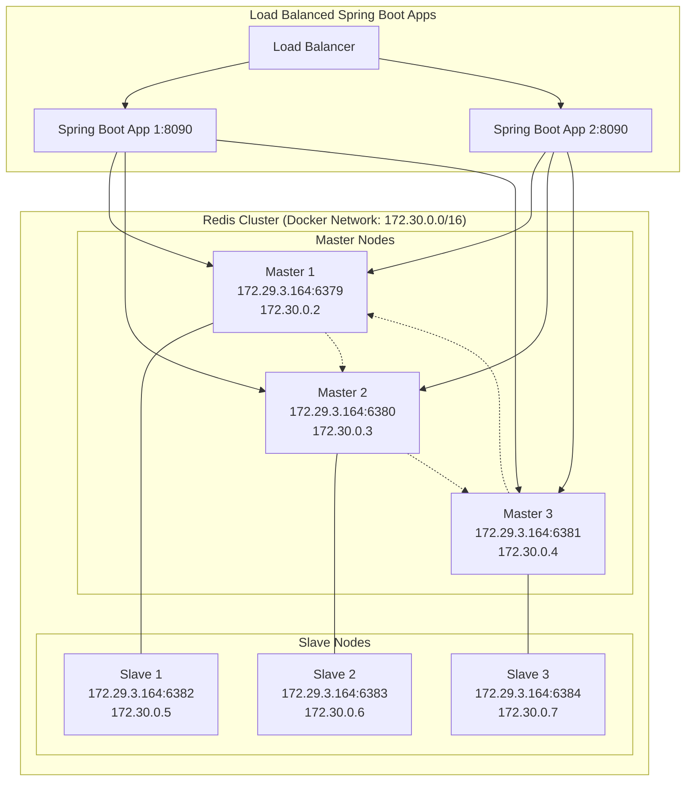
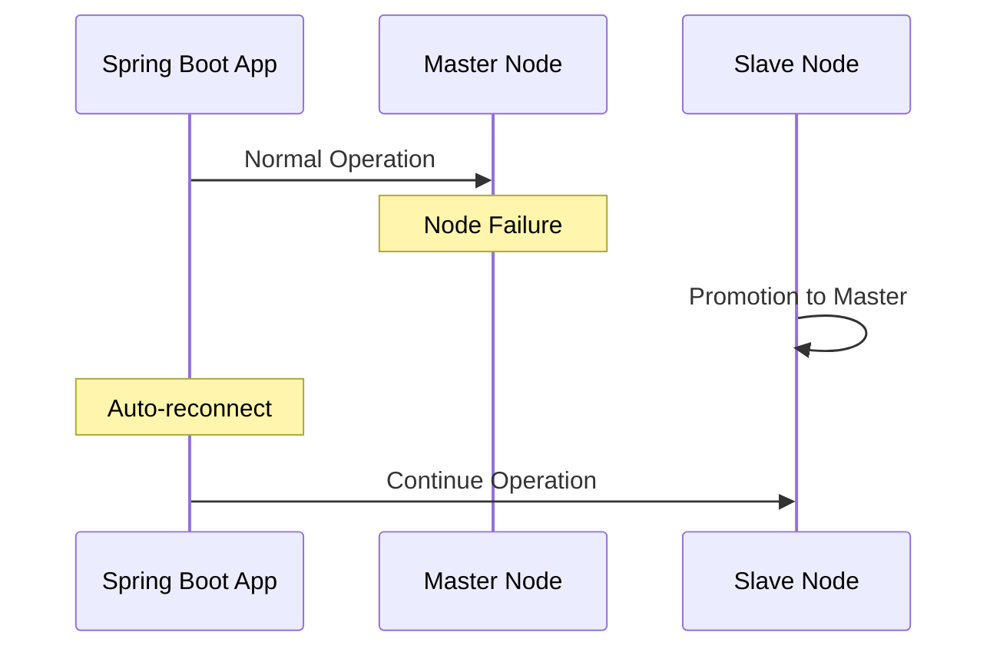

# Redis Cluster with Spring Boot Architecture





## Key Features
- Automatic failover between master and slave nodes
- Load balanced Spring Boot applications
- Docker containerized Redis nodes
- Cluster-aware Spring Boot configuration
- High availability with master-slave replication

## Node Mapping
| Role | Port | Container IP | External IP |
|------|------|-------------|-------------|
| Master 1 | 6379 | 172.30.0.2 | 172.29.3.164 |
| Master 2 | 6380 | 172.30.0.3 | 172.29.3.164 |
| Master 3 | 6381 | 172.30.0.4 | 172.29.3.164 |
| Slave 1 | 6382 | 172.30.0.5 | 172.29.3.164 |
| Slave 2 | 6383 | 172.30.0.6 | 172.29.3.164 |
| Slave 3 | 6384 | 172.30.0.7 | 172.29.3.164 |
```